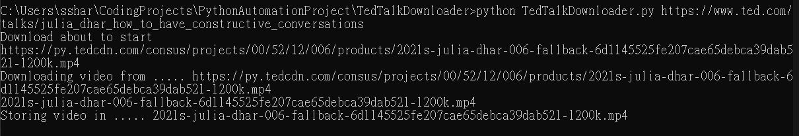
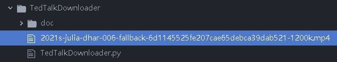

# PythonVideoDownloader
a python script that could download video source from video streaming platform

# Tools and Libraries Used
Python, Requests, BeautifulSoup

# Project Overview
- extract video source with regex and beautifulsoup from user-inputed video URLs
- download the file and store to current directory
- the project is replicable to other video streaming platform (only need to modify the video source identifier pattern in regex)

# Project Demo (Using a Tedtalk video as an example)
- python script starts scraping and processing the download after user inputs video url 

- the video mp4 will be stored at current directory in a minute

